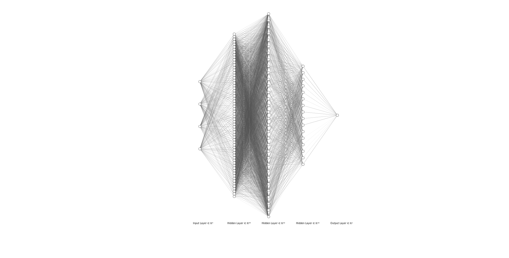

# High-Accuracy Estimation of Current Fuel Capacity Within a Fuel Tank In Low to Zero Gravity

Or, in layman's terms, a fancy AI that tells you how much fuel is left in your spaceship.

## Introduction

This project is a proof-of-concept for a fuel estimation system that can be used in low to zero gravity environments. In its current state, it uses dummy data representing a rough estimation of the Fourier Transform of a fuel tank's vibrations, taken with a piezo-electric sensor. This dummy data only contains 4 data points, but it could handle many more. This dummy data is stored in a CSV file, which you can find in the `dataset` folder.

## A Look Under the Hood

The project is written in Python 3.10.10, and uses the Tensorflow, Keras, numpy, pandas, and betterlib libraries. The project is also written in a modular fashion, so that it can be easily expanded upon. The neural network itself is a simple model, with 3 hidden layers, and 1 output layer. See the diagram below for a visual representation.



## Training

All tasks related to training are handled by the `train.py` file. Although you can just run it with the default options:

```bash
python train.py
```

You can also specify the following parameters:

- `-e` or `--epochs`: The number of epochs to train for. Defaults to 100.
- `-b` or `--batch`: The batch size to use. Defaults to 32.
- `-d` or `--dataset`: The dataset to use. Defaults to `dataset/dataset.csv`.
- `-o` or `--output`: The output file to save the model to. Defaults to `model.h5`.
- `-r` or `--random`: Whether to use random data or not. Defaults to `False`.
- `-p` or `--plot`: Whether to plot the model's loss and accuracy or not. Defaults to `False`.
- `t` or `--threshold`: The threshold to use for the "Close Enough" metric/optimizer used with the model. Defaults to 0.2.
- `-h` or `--help`: Shows the help message.
- `--test-samples`: The number of samples to use for testing. Defaults to 10 because the dataset is so small.
- `--input-features`: The number of input features to use. Defaults to 4, but will have to be increased in the future.
- `--learning-rate`: The learning rate to use. Defaults to 0.001.

So, for example, if you wanted to train the model for 4500 epochs (which is what I did for the results shown below) on a dataset located in `dataset/mycooldataset.csv` with a , you would run:

```bash
python train.py -e 4500 -d dataset/mycooldataset.csv
```

## Testing and Evaluating a Model

To evaluate a model on a dataset, you can use the `eval.py` file. It takes the following parameters:

- `-d` or `--dataset`: The dataset to use. Defaults to `dataset/dataset_eval.csv`.
- `-m` or `--model`: The model to use. Defaults to `model.h5`.
- `-t` or `--threshold`: The threshold to use for the "Close Enough" metric/optimizer used with the model. Defaults to 0.2.
- `-h` or `--help`: Shows the help message.
- `--input-features`: The number of input features to use. Defaults to 4, but will have to be increased in the future.

So, to evaluate the model on the default dataset, you would run:

```bash
python eval.py
```

## Results on Dummy Dataset

The model was trained for 4500 epochs on the dummy dataset (the "un-messed" version located at `/dataset/dummy.csv`), and was evaluated on a subset that was not used for training. Overall, it scored an accuracy of `94.28571319580078%` on 35 samples, with a threshold for of 0.1. This means that it was able to predict the fuel level within 0.1 of the actual value `94.28571319580078%` of the time. Interestingly, it scored the exact same (`94.28571319580078%`) on the "messed" version of the dataset, which was created by adding random noise to the original dataset.

After retraining the model on the "messed" dataset for 800 epochs (higher values were causing loss to increase), it scored an accuracy of `88.57142639160156%` on the 35 "un-messed" samples and `74.28571319580078%` on the "messed" samples, both with a threshold of 0.1.
